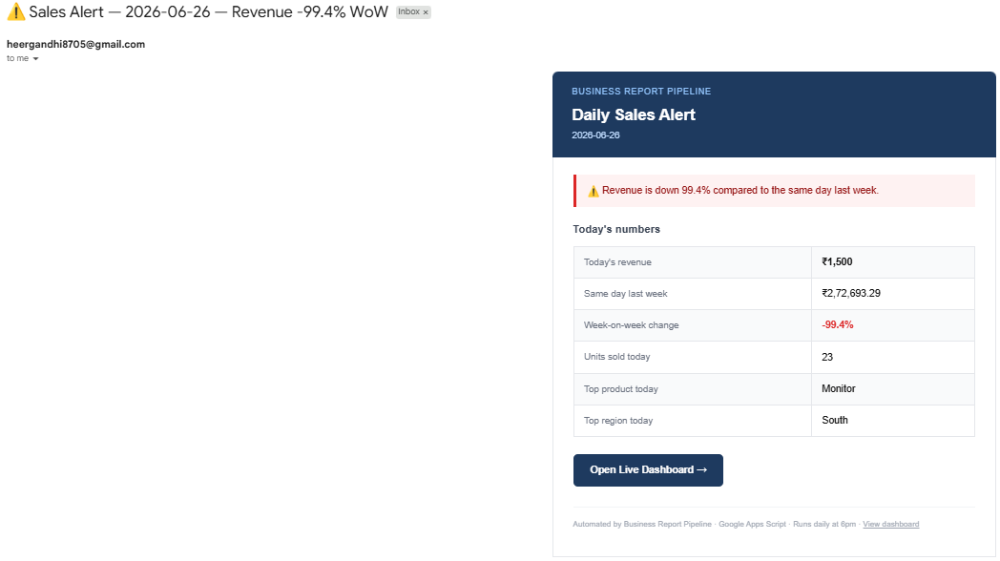
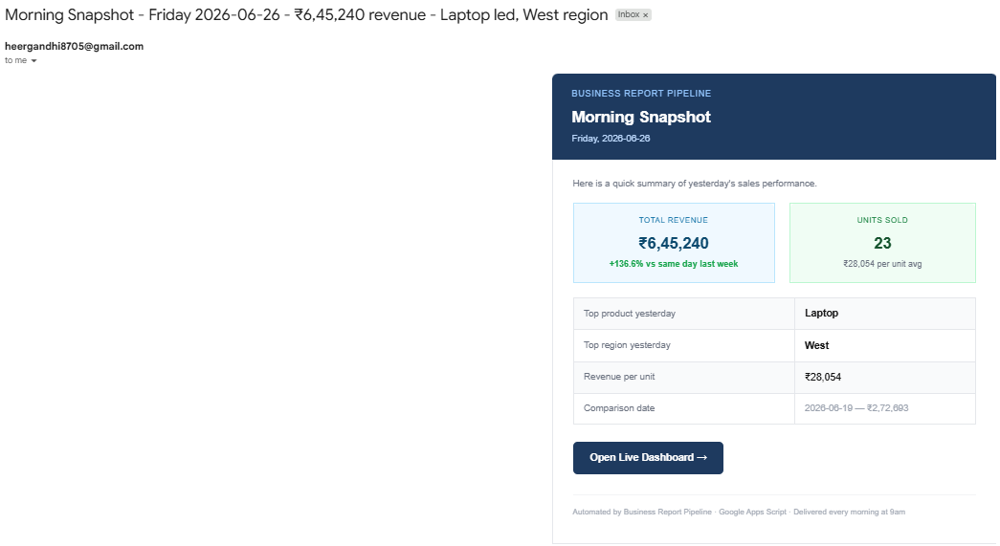
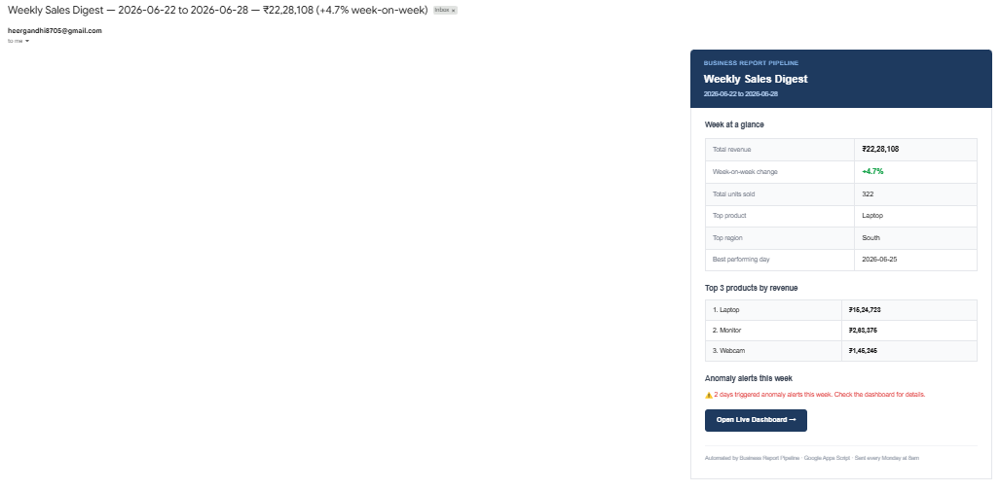
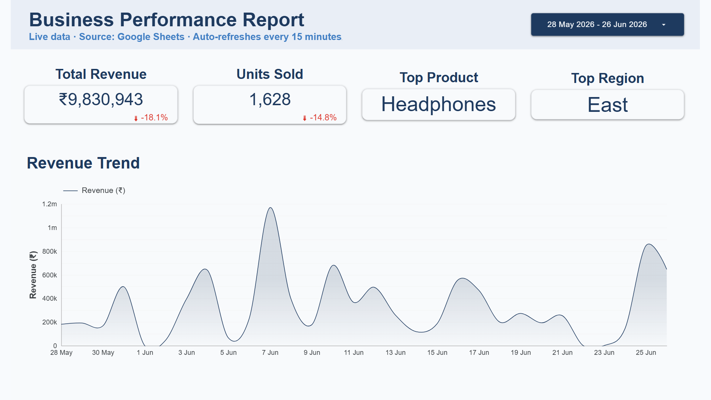
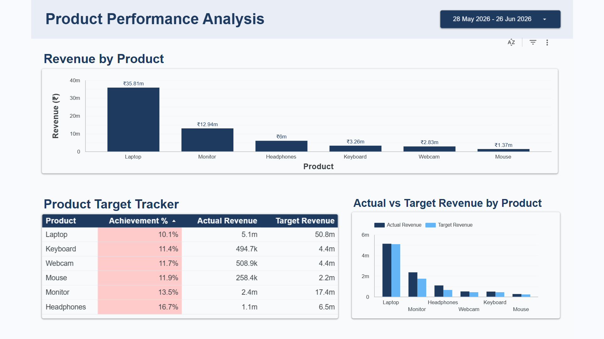
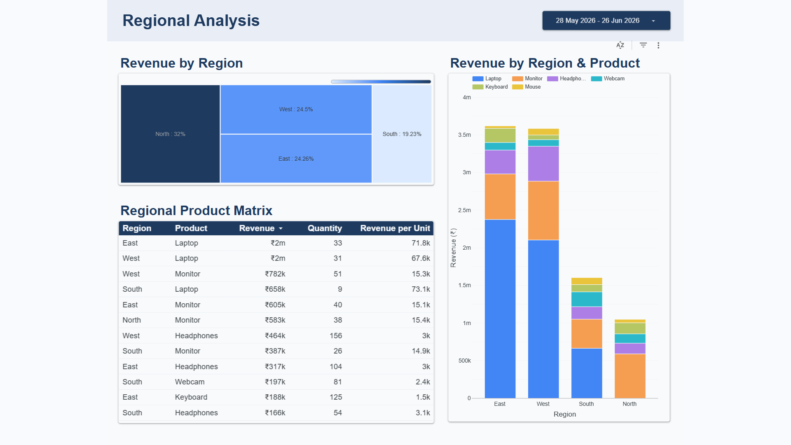
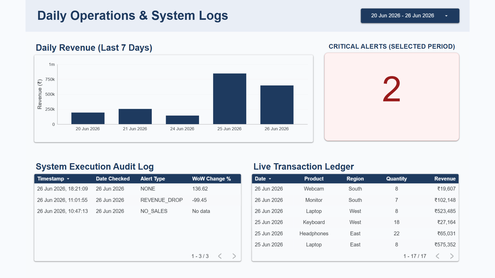
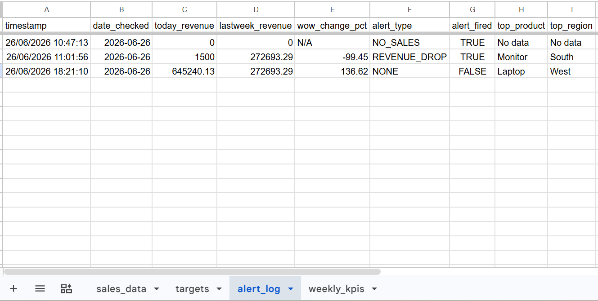
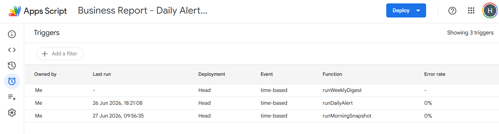

# Business Report Pipeline

An automated business intelligence system that monitors daily sales KPIs, detects revenue anomalies, and delivers formatted reports to stakeholders — running entirely on serverless infrastructure with zero maintenance cost.

---

## The Problem

Sales teams in small and mid-size businesses spend significant time every Monday manually pulling data, calculating KPIs, and compiling reports. Key questions like *"did revenue drop this week?"* or *"which product is underperforming against target?"* go unanswered until someone has time to dig through spreadsheets.

**This pipeline solves that by making insights automatic, proactive, and always available.**

---

## The Solution

A three-layer automated pipeline built on free, serverless infrastructure:

| Layer | What it does |
|---|---|
| **Live dashboard** | Looker Studio report refreshes every 15 minutes as employees enter data |
| **Anomaly detection** | Apps Script checks KPIs every evening and fires an alert if revenue drops >15% week-on-week |
| **Scheduled digests** | Morning snapshot at 9am + weekly digest every Monday 8am delivered automatically |

---

## Architecture

```
Employee enters daily sales data
           │
           ▼
   Google Sheets (single source of truth)
   ├── sales_data tab    (transactional records)
   ├── targets tab       (monthly revenue targets)
   ├── alert_log tab     (pipeline execution audit trail)
   └── weekly_kpis tab   (historical weekly summaries)
           │
           ├──► Looker Studio (live, auto-refreshes every 15 min)
           │    └── 4-page report: Executive Summary · Product Analysis
           │                       Regional Breakdown · Daily Operations
           │
           └──► Google Apps Script (serverless, runs on Google's servers)
                ├── 9:00am daily  → Morning Snapshot email
                ├── 6:00pm daily  → Anomaly Detection + Alert email (conditional)
                └── 8:00am Monday → Weekly Digest email
```

---

## Tech Stack

| Tool | Purpose | Cost |
|---|---|---|
| Google Sheets | Data storage and entry layer | Free |
| Google Apps Script | Scheduled automation and alerting | Free |
| Looker Studio | Live BI dashboard and PDF reports | Free |
| Gmail | Email delivery | Free |
| Python | Mock data generation | Free |
| GitHub | Version control and portfolio | Free |

**Total infrastructure cost: ₹0/month**

---

## Features

### 1. Anomaly detection alerting
Runs every day at 6pm. Compares today's revenue against the same weekday last week. If the drop exceeds 15%, an alert email fires immediately with the exact figures and a link to the dashboard to investigate.

Alert conditions monitored:
- Revenue drop >15% week-on-week
- Zero sales recorded (no data entry detected)

### 2. Morning snapshot
Runs every day at 9am. Sends yesterday's complete KPI summary before the workday starts — total revenue, units sold, revenue per unit, top product, top region, and week-on-week comparison.

### 3. Weekly digest
Runs every Monday at 8am. Sends a full week summary including top 3 products by revenue, best performing day, week-on-week change, and a count of how many anomaly alerts fired that week.

### 4. Live Looker Studio dashboard
4-page report connected directly to Google Sheets. Updates within 15 minutes of data entry. Pages:
- **Executive Summary** — KPI scorecards, revenue trend
- **Product Performance** — revenue by product, actual vs target tracker with heatmap
- **Regional Analysis** — treemap, stacked product mix chart, revenue per unit matrix
- **Daily Operations** — live transaction ledger, system execution audit log, critical alerts count

### 5. Full audit trail
Every pipeline run is logged to the `alert_log` sheet regardless of whether an alert fired. Stores timestamp, revenue figures, WoW change, alert type, and alert decision. Provides complete observability into pipeline behaviour.

---

## Screenshots

### Alert email — anomaly detected


### Morning snapshot email


### Weekly digest email


### Dashboard — Executive Summary


### Dashboard — Product Performance


### Dashboard — Regional Analysis


### Dashboard — Daily Operations & Audit Log


### Pipeline execution audit log (Google Sheets)


### Apps Script triggers (3 automated schedules)


---

## Live Demo

**[View Live Dashboard →](https://datastudio.google.com/reporting/eafa5016-69c3-4dc5-b13e-753fa358de1f)**

---

## Project Structure

```
business-report-pipeline/
│
├── apps_script/
│   ├── daily_alert.gs          # Anomaly detection — runs 6pm daily
│   ├── weekly_digest.gs        # Weekly summary — runs Monday 8am
│   └── morning_snapshot.gs     # Daily briefing — runs 9am daily
│
├── data/
│   └── generate_data.py        # Mock sales data generator (522 rows, 6 months)
│
├── screenshots/                # Email and dashboard screenshots
│
└── README.md
```

---

## How It Works — Key Design Decisions

**Why Google Apps Script instead of n8n or Zapier?**
Apps Script runs on Google's servers with no hosting cost, no execution limits for personal use, and native access to Google Sheets and Gmail without API authentication setup. For a pipeline that lives entirely in the Google ecosystem, it's the most appropriate tool.

**Why an audit log tab?**
Production data pipelines need observability. If the manager doesn't receive an expected alert, the audit log provides a timestamped record of every run — what data the script saw, what calculation it made, and what decision it took. This is standard practice in data engineering.

**Why separate morning snapshot and evening alert?**
Different purpose, different audience, different trigger. The morning snapshot is proactive — it runs regardless and gives management a daily briefing. The evening alert is reactive — it only fires when something is wrong, so it carries urgency. Combining them would dilute both signals.

**Why Looker Studio over Tableau or Power BI?**
Native Google Sheets integration with live refresh (15 minutes on free tier), no desktop client required, built-in PDF export and scheduled email delivery, and free permanent hosting. For a pipeline built on Google's infrastructure, Looker Studio is the natural choice.

**Why include a targets sheet?**
Revenue alone doesn't tell you if performance is good or bad without a baseline. The targets sheet enables actual vs target comparison — the Achievement % column in the Product Target Tracker shows at a glance which products are ahead of or behind plan. This mirrors how sales dashboards work at companies like Salesforce and HubSpot.

---

## Impact

| Metric | Before | After |
|---|---|---|
| Time to compile weekly report | ~2 hours manual | 0 minutes — fully automated |
| Time to detect revenue drop | Next Monday morning | Same evening (6pm alert) |
| Dashboard availability | Only when someone builds it | 24/7, updates every 15 minutes |
| Report delivery reliability | Depends on who remembers | 100% — Google's servers |
| Infrastructure cost | N/A | ₹0/month |

---

## Setup Instructions

### Prerequisites
- Google account
- Python 3.8+ (for data generation only)

### Steps

**1. Generate mock data**
```bash
python data/generate_data.py
```
Outputs `sales_data.csv` and `targets.csv`

**2. Set up Google Sheets**
- Create a new Google Sheet named `Business Report Pipeline`
- Import `sales_data.csv` as tab `sales_data`
- Import `targets.csv` as tab `targets`
- Create empty tabs: `alert_log` and `weekly_kpis` with headers as documented

**3. Deploy Apps Script**
- In your Google Sheet: Extensions → Apps Script
- Create a new project named `Business Report — Daily Alert Pipeline`
- Copy code from `apps_script/daily_alert.gs` into the editor
- Add `weekly_digest.gs` and `morning_snapshot.gs` code below
- Update `SPREADSHEET_ID` and `ALERT_EMAIL` constants at the top
- Set up 3 time-based triggers as documented

**4. Connect Looker Studio**
- Go to lookerstudio.google.com
- Create new report → connect Google Sheets → select your file
- Build 4 pages as shown in screenshots
- Set data freshness to 15 minutes
- Paste the published report URL into `DASHBOARD_URL` in Apps Script

---

## Author

**Heer Gandhi**  
 [GitHub](https://github.com/gandhiheer7)

---

*Built as a portfolio project demonstrating end-to-end data pipeline design, business intelligence reporting, and serverless automation.*
